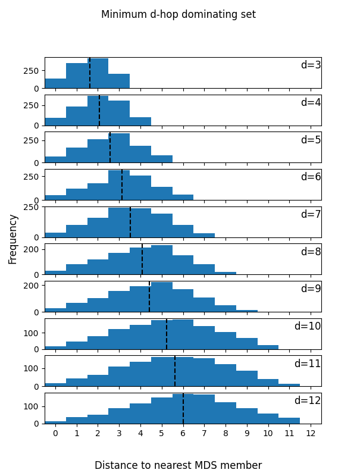
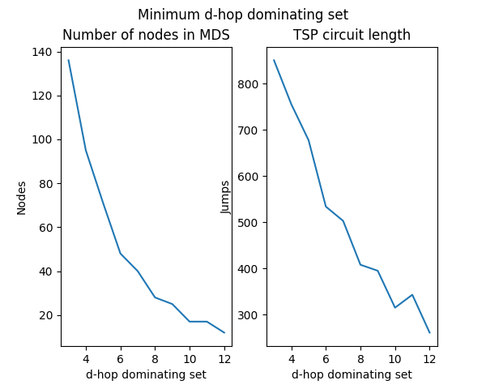

# Calculating the ideal placement of logistics depots in EVE
## The problem
I heard an interesting problem recently that I though I'd informally explore.  How could you place logistics depots around mainland highsec space such that a wormhole with a highsec static will always be within a few jumps of a depot?  A few important questions follow, like what is "a few"?  How many depots would you have to manage?  What systems qualify for depot placement at all?  All of these factors are tradeoffs and effect each other.

## Technology used
All done in Python.  The map itself was initially downloaded from the EVE Swagger Interface (ESI), processed through some light Pandas filtering, then loaded into NetworkX (sometimes referred to as `nx`), then finally graphing was done in Matplotlib.  Files are generated along the way at each step to prevent expensive re-calculation or re-downloading as development progressed.  Final recommendations for a select range of *d* values can be found under the releases tab of this repo.

## Initial observations and assumptions
After creating a graph from the ESI and filtering to only include mainland highsec systems we can make a few observations.  There are 1,108 highsec systems in mainland highsec, such that they are accessible without going through lowsec.  The average shortest path length as calculated by `nx.average_shortest_path_length` is about 27.50 nodes, where a node is an EVE system.  The average distance from any system to Jita is 28.84 nodes.  That means that for any proposed solution, this is a good approximation for the upper bound, i.e. we want a solution that's significantly better than either of those.  For any system considered for a depot, I have added the requirement that it has a station.  This is of course arbitrary as one could place an upwell structure in a system, and doesn't take corp office availability into consideration.  Finally, I have assumed that as the main trade hub, Jita will be a necessary depot and thus based the initial approximations on including Jita.  Other systems or even a set of systems could be included in the initial solve, but that would introduce too much variability for now.  Amarr would be another interesting starting point, as I believe it's the most central system.

## Theory
After doing a little bit of research, this is a variant of the dominating set problem, called the "d-hop dominating set".  This is considered an NP-Complete problem.  That is to say, it's easy to verify the answer, but difficult to calculate an optimal solution.  When I was first researching this problem the first paper I looked at was [Approximation Algorithms for D-Hop Dominating Set Problem](https://worldcomp-proceedings.com/proc/p2016/DMI8038.pdf).  The main part of the paper I was interested in was the utility of the d-closure and how to calculate it.  The d-closure is similar to a transitive closure or even a series of successive transitive closures.  In essence, the d-closure states that all nodes less than *d* distance from a node should be connected by an edge.  This is useful because once you have the d-closure of a graph, a dominating set of that closure is a d-hop dominating set.  The paper goes on to list a few algorithms that work generally for approximation of the minimum dominating set, regardless of the d-closure.  I used algorithm 2, which would best be described as a "greedy approximation algorithm".

## How far would you have to go?
Because the *d* value specifies the maximum distance from any highsec system to a depot, as *d* increases, we can decrease the number of depots.  A useful observation is that the average distance to a depot is about half of whatever we decide the maximum distance *d* should be.  That is to say if we decide *d*=7, then on average the distance to a depot from any highsec system is 3.5.  The distribution of distances to a depot appears to be normal as well.  The desired average and maximum distances is something that would have to be determined somewhat arbitrarily, hopefully with the help of the graphs to help make an informed decision.  Note that "MDS Member" refers to a member of the minimum (d-hop) dominating set, or in other words a  logistics depot.

## How many depots would you have to manage?
The other major consideration is how many depots you would have to manage.  There must be a tradeoff between how many depots you place, and the distance one must travel to arrive at a depot.  Additionally, if you wanted to visit every depot and return home at the end, how far would you have to go for that?  Fortunately the 2nd question is a rather common one, called the Traveling Salesman Problem (TSP).  It's included in NetworkX, but is a little expensive to calculate.

## Final (arbitrary) recommendations
Personally, I think a *d* value of around 8 is ideal.  This mean you'd be able to cover all 1108 mainland highsec systems with just 28 depots, including Jita.  On average, any highsec static will be about 4 systems (just 3 jumps) from a depot.

## Produced data and how to use it
I've calculated the results for *d* values 3 through 12 and included a .json file with some stats, and the depot system IDs, as well as a .csv file with information about every system, including what depot is nearest.

## Future work if I revisit this
There are certainly some opportunities for improvement, both in implementation, and in concept.  My first thought is that there are some unimportant depots included in any set.  A well connected depot system currently has the possibility to cover a large number of its neighboring systems.  However, some depot systems on the edge of highsec space only cover a very small number of systems, and ultimately may not be worth maintaining.  You would no longer be able to make the claim that "any highsec system is guaranteed to be *d* hops or less from a depot", but the impact would be minimal.  

Additionally, exploring other weights, for a more optimal logistics solution would be interesting.  Currently the major factor is the degree of connectivity of a system, so that we can minimize depot count.  Some other interesting factors might be the avoidance of routes through choke points like the infamous Uedama, filtering to only place depots where corp offices are available, or even variable regional density.